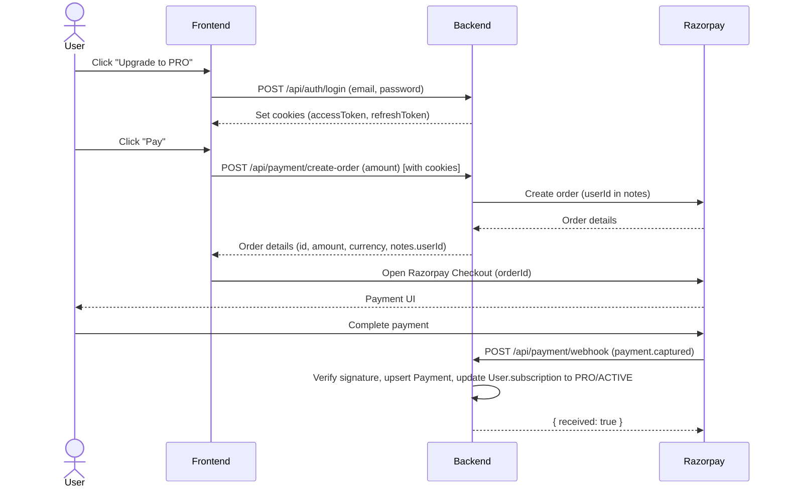

## NavRiox Backend API Documentation

This document describes the NavRiox backend for frontend developers: how to call the APIs, authentication model, payment/subscription workflow, and project structure.

---

## Tech Stack & Base URL

- **Runtime**: Node.js, Express
- **Database**: MongoDB (via Mongoose)
- **Auth**: JWT (HTTP-only cookies)
- **Payments**: Razorpay (orders + webhooks)
- **Base URL (local)**: `http://localhost:PORT`
  - **Default start command**: `npm run dev`
  - **Main entry**: `src/server.js`

---

## Project Structure (High Level)

Only the folders relevant for frontend integration are listed here.

```txt
src/
  app.js                 # Express app configuration & routes mounting
  server.js              # Server bootstrap, DB connection
  config/
    db.js                # MongoDB connection
  middleware/
    auth.middleware.js   # JWT auth guard (protect)
  models/
    user.model.js        # User schema + subscription info
    payment.model.js     # Payment & Razorpay event records
  modules/
    auth/
      auth.routes.js     # /api/auth endpoints
      auth.controller.js # Express handlers for auth
      auth.service.js    # Business logic for register/login
    payment/
      payment.routes.js  # /api/payment endpoints
      payment.controller.js
      payment.service.js # Razorpay order creation
      payment.webhook.js # Razorpay webhook handler
  utils/
    hash.js              # Password hashing/comparison
    jwt.js               # Access/refresh token generation
```

---

## Authentication Overview

- **Auth Type**: Email + password login.
- **Tokens**:
  - **Access token**: Stored in `accessToken` HTTP-only cookie.
  - **Refresh token**: Stored in `refreshToken` HTTP-only cookie, hashed in DB.
- **Protection**:
  - Protected routes use middleware `protect` (`src/middleware/auth.middleware.js`), which:
    - Reads `accessToken` cookie.
    - Verifies via `JWT_ACCESS_SECRET`.
    - Sets `req.user` to the decoded user payload.
- **Frontend implication**:
  - You **don’t** need to manually attach Authorization headers.
  - Just make sure requests are sent with `credentials: "include"` so cookies are sent.

### Auth Routes

Base path for all auth routes: ` /api/auth`

#### POST `/api/auth/register`

- **Description**: Register a new user.
- **Auth**: Public.
- **Request Body (JSON)**:

```json
{
  "name": "John Doe",
  "email": "john@example.com",
  "password": "strongpassword"
}
```

- **Success Response (201)**:

```json
{
  "message": "User registered successfully"
}
```

- **Error Cases**:
  - `400/409` if email already exists (server throws `"Email already exists"`).

#### POST `/api/auth/login`

- **Description**: Login and receive HTTP-only cookies with access/refresh tokens.
- **Auth**: Public.
- **Request Body (JSON)**:

```json
{
  "email": "john@example.com",
  "password": "strongpassword"
}
```

- **Success Response (200)**:
  - **Cookies set**:
    - `accessToken`: HttpOnly, `sameSite: "Strict"`, `secure` in production.
    - `refreshToken`: HttpOnly, `sameSite: "Strict"`, `secure` in production.
  - **Body**:

```json
{
  "message": "Login successful"
}
```

- **Error Cases**:
  - `401` with `"Invalid credentials"` when email or password is wrong.

---

## Payment & Subscription Overview

- **Gateway**: Razorpay.
- **User Flow** (high level):
  1. User logs in (gets cookies).
  2. Frontend calls `POST /api/payment/create-order` with the desired amount.
  3. Backend creates Razorpay order with `notes.userId` attached.
  4. Frontend uses Razorpay Checkout with returned order.
  5. Razorpay calls backend webhook `/api/payment/webhook` when payment is captured/failed.
  6. Backend persists `Payment` record and updates `User.subscription`.

### Payment Routes

Base path for all payment routes: `/api/payment`

#### POST `/api/payment/create-order`

- **Description**: Creates a Razorpay order for the logged-in user.
- **Auth**: **Protected** (`protect` middleware) – requires valid `accessToken` cookie.
- **Headers**:
  - Must send cookies → in browser fetch: `credentials: "include"`.
- **Request Body (JSON)**:

```json
{
  "amount": 499
}
```

- **Backend Logic**:
  - Calls `paymentService.createOrder(userId, amount)`.
  - Creates an order in Razorpay with:
    - `amount * 100` (paise),
    - `currency: "INR"`,
    - `notes.userId` = current user id.
- **Success Response (200)**:
  - Directly returns the Razorpay order object (shape from Razorpay SDK), for example:

```json
{
  "id": "order_XXXX",
  "amount": 49900,
  "currency": "INR",
  "receipt": "receipt_1739697770000",
  "status": "created",
  "notes": {
    "userId": "65f..."
  }
}
```

- **Error Cases**:
  - `401` if no/invalid `accessToken` cookie.
  - `500` for Razorpay or server errors.

#### POST `/api/payment/webhook`

- **Description**: Razorpay webhook endpoint (for Razorpay servers only, **not** for frontend).
- **Auth**: No auth; signature verification using `x-razorpay-signature` + `RAZORPAY_WEBHOOK_SECRET`.
- **Content-Type**: `application/json` **with raw body** (already configured in `app.js`).
- **Request Body**:
  - Raw Razorpay event payload, e.g. for `payment.captured` or `payment.failed`.

- **Backend Logic (simplified)**:
  - Verifies HMAC signature using `RAZORPAY_WEBHOOK_SECRET`.
  - Ignores already processed events (`Payment.eventId` uniqueness).
  - For `payment.captured`:
    - Extracts payment info, especially:
      - `paymentEntity.id` → `razorpayPaymentId`
      - `paymentEntity.order_id` → `razorpayOrderId`
      - `paymentEntity.amount`, `currency`
      - `paymentEntity.notes.userId`
    - Upserts `Payment` document.
    - Finds `User` by `userId` and sets:
      - `subscription.plan = "PRO"`
      - `subscription.status = "ACTIVE"`
      - `subscription.expiresAt = now + 1 month`
  - For `payment.failed`:
    - Creates a `Payment` record with `status = "FAILED"`.
  - Always returns:

```json
{
  "received": true
}
```

- **Error Cases**:
  - `400` `"Missing signature"` if header is absent.
  - `400` `"Invalid signature"` if HMAC mismatch.
  - `400` `"UserId missing in notes"` if webhook data doesn’t contain notes.userId.
  - `500` `"Internal webhook error"` on unhandled errors.

---

## User & Payment Data Shapes

### User Model (simplified)

Key fields relevant to frontend:

- **User**
  - `name: string`
  - `email: string`
  - `role: "USER" | "ADMIN"`
  - `subscription`:
    - `plan: "FREE" | "PRO" | ...` (currently `"FREE"` or `"PRO"`)
    - `status: "INACTIVE" | "ACTIVE"`
    - `expiresAt: Date | null`

### Payment Model (simplified)

- **Payment**
  - `razorpayOrderId: string`
  - `razorpayPaymentId?: string`
  - `userId: ObjectId<User>`
  - `amount: number`
  - `currency: string`
  - `status: "CREATED" | "SUCCESS" | "FAILED"`
  - `eventId: string` (Razorpay event id, unique)

---

## End-to-End Workflows

### 1. Auth + Subscription Upgrade Flow

Text description:

1. **Register**: `POST /api/auth/register`.
2. **Login**: `POST /api/auth/login` → sets `accessToken` & `refreshToken` cookies.
3. **Create Order**: From frontend, call `POST /api/payment/create-order` with `credentials: "include"`.
4. **Open Razorpay Checkout** on frontend using returned order `id`.
5. **Payment Success**:
   - Razorpay triggers webhook to `/api/payment/webhook` (`payment.captured`).
   - Backend records payment + sets `user.subscription.plan = "PRO"`, `status = "ACTIVE"`, `expiresAt = now + 1 month`.
6. **Frontend** can fetch the user profile (when that endpoint is added) and check `subscription` to show PRO features.

### Sequence Diagram (Mermaid)

You can view this visually (if your markdown viewer supports Mermaid):



---

## Example Frontend Calls

### Login (fetch)

```ts
async function login(email: string, password: string) {
  const res = await fetch("/api/auth/login", {
    method: "POST",
    headers: { "Content-Type": "application/json" },
    credentials: "include",
    body: JSON.stringify({ email, password }),
  });

  if (!res.ok) {
    throw new Error("Login failed");
  }
}
```

### Create Payment Order (fetch)

```ts
async function createOrder(amount: number) {
  const res = await fetch("/api/payment/create-order", {
    method: "POST",
    headers: { "Content-Type": "application/json" },
    credentials: "include",
    body: JSON.stringify({ amount }),
  });

  if (!res.ok) {
    throw new Error("Failed to create order");
  }

  return res.json(); // Razorpay order object
}
```

---

## Environment Variables

For local development, define these in your `.env` file:

- **Server & DB**
  - `PORT` – e.g. `5000`
  - `MONGODB_URI` – MongoDB connection string
- **JWT**
  - `JWT_ACCESS_SECRET` – secret for access tokens
  - `JWT_REFRESH_SECRET` – secret for refresh tokens
- **Razorpay**
  - `RAZORPAY_KEY_ID`
  - `RAZORPAY_KEY_SECRET`
  - `RAZORPAY_WEBHOOK_SECRET`

---

## Notes for Frontend Developers

- Always call backend with `credentials: "include"` after login so cookies are sent.
- For local dev, configure your frontend dev server proxy to forward `/api/*` to the Node backend (to avoid CORS issues).
- Treat `/api/payment/webhook` as **backend-only**; the frontend should never call it directly.
- Subscription state is driven entirely by Razorpay webhooks and lives on the `User.subscription` object.

