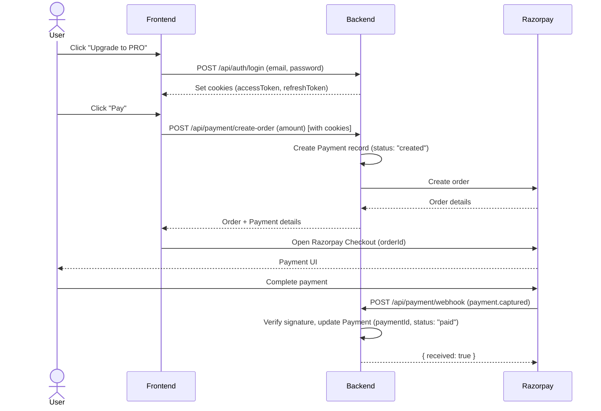

## NavRiox Backend API Documentation

This document describes the NavRiox backend for frontend developers: how to call the APIs, authentication model, payment/subscription workflow, and project structure.

---

## Tech Stack & Base URL

- **Runtime**: Node.js, Express
- **Database**: MongoDB (via Mongoose)
- **Auth**: JWT (HTTP-only cookies)
- **Payments**: Razorpay (orders + webhooks)
- **Image Processing**: Sharp, Canvas (for passport photo generation)
- **File Uploads**: Multer
- **Security**: Helmet, CORS, Rate Limiting
- **Logging**: Morgan
- **Base URL (local)**: `http://localhost:PORT`
  - **Default start command**: `npm run dev`
  - **Main entry**: `src/server.js`
  - **App config**: `src/app.js` (middleware, routes)

---

## Project Structure (High Level)

Only the folders relevant for frontend integration are listed here.

```txt
src/
  app.js                 # Express app configuration & routes mounting
  server.js              # Server bootstrap, DB connection
  config/
    db.js                # MongoDB connection
    razorpay.js          # Razorpay client configuration
  middleware/
    auth.middleware.js   # JWT auth guard (protect)
  models/
    user.model.js        # User schema + subscription info
    payment.model.js     # Payment & Razorpay event records
  modules/
    auth/
      auth.routes.js     # /api/auth endpoints
      auth.controller.js # Express handlers for auth
      auth.service.js    # Business logic for register/login
    payment/
      payment.routes.js  # /api/payment endpoints
      payment.controller.js # Razorpay order creation & payment handling
      payment.webhook.js # Razorpay webhook handler
    passport/
      passport.routes.js # /api/passport endpoints
      passport.controller.js # Passport photo generation handlers
      passport.service.js # Business logic for passport processing
  utils/
    hash.js              # Password hashing/comparison
    jwt.js               # Access/refresh token generation
    imageProcessor.js    # Image processing utilities (Sharp, Canvas)
  uploads/               # Temporary storage for uploaded images
  output/                # Generated passport photo sheets
```

---

## Authentication Overview

- **Auth Type**: Email + password login.
- **Tokens**:
  - **Access token**: Stored in `accessToken` HTTP-only cookie.
  - **Refresh token**: Stored in `refreshToken` HTTP-only cookie, hashed in DB.
- **Protection**:
  - Protected routes use middleware `protect` (`src/middleware/auth.middleware.js`), which:
    - Reads `accessToken` cookie.
    - Verifies via `JWT_ACCESS_SECRET`.
    - Sets `req.user` to the decoded user payload (contains `id` and `role`).
    - Returns `401` with `"Unauthorized"` if token is missing, or `"Token expired or invalid"` if verification fails.
- **Token Details**:
  - **Access token**: Expires in 15 minutes, payload: `{ id: user._id, role: user.role }`
  - **Refresh token**: Expires in 7 days, payload: `{ id: user._id }`, hashed and stored in `User.refreshToken`
- **Frontend implication**:
  - You **don’t** need to manually attach Authorization headers.
  - Just make sure requests are sent with `credentials: "include"` so cookies are sent.

### Auth Routes

Base path for all auth routes: ` /api/auth`

#### POST `/api/auth/register`

- **Description**: Register a new user.
- **Auth**: Public.
- **Request Body (JSON)**:

```json
{
  "name": "John Doe",
  "email": "john@example.com",
  "password": "strongpassword"
}
```

- **Success Response (201)**:

```json
{
  "message": "User registered successfully"
}
```

- **Error Cases**:
  - `400/409` if email already exists (server throws `"Email already exists"`).

#### POST `/api/auth/login`

- **Description**: Login and receive HTTP-only cookies with access/refresh tokens.
- **Auth**: Public.
- **Request Body (JSON)**:

```json
{
  "email": "john@example.com",
  "password": "strongpassword"
}
```

- **Success Response (200)**:
  - **Cookies set**:
    - `accessToken`: HttpOnly, `sameSite: "Strict"`, `secure` in production.
    - `refreshToken`: HttpOnly, `sameSite: "Strict"`, `secure` in production.
  - **Body**:

```json
{
  "message": "Login successful"
}
```

- **Error Cases**:
  - `401` with `"Invalid credentials"` when email or password is wrong.

---

## Payment & Subscription Overview

- **Gateway**: Razorpay.
- **User Flow** (high level):
  1. User logs in (gets cookies).
  2. Frontend calls `POST /api/payment/create-order` with the desired amount.
  3. Backend creates Razorpay order and immediately creates a `Payment` record with status `"created"`.
  4. Frontend uses Razorpay Checkout with returned order.
  5. Razorpay calls backend webhook `/api/payment/webhook` when payment is captured.
  6. Backend updates the existing `Payment` record with `paymentId` and sets status to `"paid"`.

### Payment Routes

Base path for all payment routes: `/api/payment`

#### POST `/api/payment/create-order`

- **Description**: Creates a Razorpay order for the logged-in user.
- **Auth**: **Protected** (`protect` middleware) – requires valid `accessToken` cookie.
- **Headers**:
  - Must send cookies → in browser fetch: `credentials: "include"`.
- **Request Body (JSON)**:

```json
{
  "amount": 499
}
```

- **Backend Logic**:
  - Extracts `userId` from `req.user.id` (set by `protect` middleware).
  - Creates a Razorpay order with:
    - `amount * 100` (converts to paise),
    - `currency: "INR"`,
    - `receipt: "receipt_<timestamp>"`.
  - Immediately creates a `Payment` record in the database with:
    - `user`: userId (ObjectId reference),
    - `orderId`: Razorpay order id,
    - `amount`: original amount (not in paise),
    - `currency`: "INR",
    - `status`: "created".
- **Success Response (200)**:

```json
{
  "success": true,
  "message": "Order created successfully",
  "order": {
    "id": "order_XXXX",
    "amount": 49900,
    "currency": "INR",
    "receipt": "receipt_1739697770000",
    "status": "created"
  },
  "payment": {
    "_id": "...",
    "user": "65f...",
    "orderId": "order_XXXX",
    "amount": 499,
    "currency": "INR",
    "status": "created",
    "createdAt": "...",
    "updatedAt": "..."
  }
}
```

- **Error Cases**:
  - `400` with `"Valid amount required"` if amount is missing or <= 0.
  - `401` if no/invalid `accessToken` cookie.
  - `500` with error details for Razorpay or server errors.

#### POST `/api/payment/webhook`

- **Description**: Razorpay webhook endpoint (for Razorpay servers only, **not** for frontend).
- **Auth**: No auth; signature verification using `x-razorpay-signature` + `RAZORPAY_WEBHOOK_SECRET`.
- **Content-Type**: `application/json` **with raw body** (already configured in `app.js`).
- **Request Body**:
  - Raw Razorpay event payload, e.g. for `payment.captured` or `payment.failed`.

- **Backend Logic**:
  - Verifies HMAC signature using `RAZORPAY_WEBHOOK_SECRET` by comparing `x-razorpay-signature` header with computed signature.
  - For `payment.captured` event:
    - Extracts payment data from `req.body.payload.payment.entity`.
    - Finds existing `Payment` record by `orderId` (from `paymentData.order_id`).
    - Updates the `Payment` record with:
      - `paymentId`: `paymentData.id`
      - `status`: `"paid"`
  - Always returns:

```json
{
  "received": true
}
```

- **Error Cases**:
  - `400` with `"Invalid signature"` if HMAC signature verification fails.
  - `400` with `"Webhook failed"` on unhandled errors.

---

## Passport Photo Generation Overview

- **Purpose**: Generate A4 sheets with 6 passport-sized photos from a user-uploaded image.
- **Processing**:
  - Resizes uploaded image to passport dimensions (390x480px)
  - Applies background color (default: white)
  - Arranges 6 photos on an A4 sheet (2480x3508px) with borders
  - Returns the generated A4 sheet as a downloadable JPEG file

### Passport Routes

Base path for all passport routes: `/api/passport`

#### POST `/api/passport/generate`

- **Description**: Generates an A4 sheet with 6 passport photos from an uploaded image.
- **Auth**: Public (no authentication required).
- **Content-Type**: `multipart/form-data`
- **Request Body (Form Data)**:
  - `photo`: Image file (required) - The photo to be processed
  - `bgColor`: String (optional) - Background color in hex format (default: `"#ffffff"`)

- **Backend Logic**:
  - Accepts image file via Multer middleware
  - Processes image using Sharp:
    - Resizes to passport dimensions (390x480px)
    - Applies background color
  - Creates A4 canvas using Canvas library
  - Arranges 6 photos horizontally with black borders
  - Saves output to `src/output/` directory
  - Returns the generated file as download

- **Success Response (200)**:
  - **Content-Type**: `image/jpeg` or `application/octet-stream`
  - **Body**: Binary file (A4 sheet with 6 passport photos)
  - **Headers**: `Content-Disposition: attachment; filename="a4-<timestamp>.jpg"`

- **Error Cases**:
  - `400` with `{ success: false, message: "Photo is required" }` if no file is uploaded.
  - `500` with `{ success: false, message: "Passport generation failed" }` on processing errors.

---

## User & Payment Data Shapes

### User Model (simplified)

Key fields relevant to frontend:

- **User**
  - `name: string`
  - `email: string`
  - `role: "USER" | "ADMIN"`
  - `subscription`:
    - `plan: "FREE" | "PRO" | ...` (currently `"FREE"` or `"PRO"`)
    - `status: "INACTIVE" | "ACTIVE"`
    - `expiresAt: Date | null`

### Payment Model (simplified)

- **Payment**
  - `user: ObjectId<User>` (reference to User model)
  - `orderId: string` (Razorpay order ID, unique)
  - `paymentId?: string` (Razorpay payment ID, set when payment is captured)
  - `amount: number` (amount in rupees, not paise)
  - `currency: string` (default: "INR")
  - `status: "created" | "paid" | "failed"`
  - `createdAt: Date`
  - `updatedAt: Date`

---

## End-to-End Workflows

### 1. Auth + Subscription Upgrade Flow

Text description:

1. **Register**: `POST /api/auth/register`.
2. **Login**: `POST /api/auth/login` → sets `accessToken` & `refreshToken` cookies.
3. **Create Order**: From frontend, call `POST /api/payment/create-order` with `credentials: "include"`.
4. **Open Razorpay Checkout** on frontend using returned order `id`.
5. **Payment Success**:
   - Razorpay triggers webhook to `/api/payment/webhook` (`payment.captured`).
   - Backend updates the existing `Payment` record with `paymentId` and sets `status = "paid"`.
6. **Frontend** can fetch the user profile (when that endpoint is added) and check payment status.

### Sequence Diagram (Mermaid)

You can view this visually (if your markdown viewer supports Mermaid):



---

## Example Frontend Calls

### Login (fetch)

```ts
async function login(email: string, password: string) {
  const res = await fetch("/api/auth/login", {
    method: "POST",
    headers: { "Content-Type": "application/json" },
    credentials: "include",
    body: JSON.stringify({ email, password }),
  });

  if (!res.ok) {
    throw new Error("Login failed");
  }
}
```

### Create Payment Order (fetch)

```ts
async function createOrder(amount: number) {
  const res = await fetch("/api/payment/create-order", {
    method: "POST",
    headers: { "Content-Type": "application/json" },
    credentials: "include",
    body: JSON.stringify({ amount }),
  });

  if (!res.ok) {
    throw new Error("Failed to create order");
  }

  const data = await res.json();
  return data; // { success, message, order, payment }
}
```

### Generate Passport Photos (fetch with FormData)

```ts
async function generatePassportPhoto(file: File, bgColor?: string) {
  const formData = new FormData();
  formData.append("photo", file);
  if (bgColor) {
    formData.append("bgColor", bgColor);
  }

  const res = await fetch("/api/passport/generate", {
    method: "POST",
    credentials: "include",
    body: formData,
  });

  if (!res.ok) {
    throw new Error("Failed to generate passport photos");
  }

  // Handle file download
  const blob = await res.blob();
  const url = window.URL.createObjectURL(blob);
  const a = document.createElement("a");
  a.href = url;
  a.download = `passport-${Date.now()}.jpg`;
  document.body.appendChild(a);
  a.click();
  window.URL.revokeObjectURL(url);
  document.body.removeChild(a);
}
```

---

## Environment Variables

For local development, define these in your `.env` file:

- **Server & DB**
  - `PORT` – e.g. `5000`
  - `MONGODB_URI` – MongoDB connection string
- **JWT**
  - `JWT_ACCESS_SECRET` – secret for access tokens
  - `JWT_REFRESH_SECRET` – secret for refresh tokens
- **Razorpay**
  - `RAZORPAY_KEY_ID`
  - `RAZORPAY_KEY_SECRET`
  - `RAZORPAY_WEBHOOK_SECRET`

---

## Notes for Frontend Developers

- Always call backend with `credentials: "include"` after login so cookies are sent.
- For local dev, configure your frontend dev server proxy to forward `/api/*` to the Node backend (to avoid CORS issues).
- Treat `/api/payment/webhook` as **backend-only**; the frontend should never call it directly.
- The backend uses rate limiting (100 requests per 15 minutes per IP) to prevent abuse.
- CORS is configured to allow credentials; ensure your frontend origin is properly configured in production.
- Payment records are created immediately when an order is created, and updated when payment is captured via webhook.
- For passport photo generation:
  - Use `FormData` to send image files (don't set `Content-Type` header, browser will set it automatically with boundary).
  - The endpoint returns a binary file (JPEG), so handle it as a blob for download.
  - Background color is optional; if not provided, defaults to white (`#ffffff`).
  - Uploaded files are temporarily stored in `src/uploads/` and processed files in `src/output/`.

